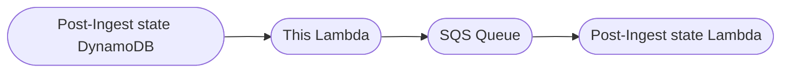

# DR2 State Change DDB Queue Sender

Since we are using a batch size of 100 in the Event Source Mapping, when a single item failed to process, the whole batch is failed.
The Post-Ingest state Lambda then continued to fail until the unprocessable message fell out of the DynamoDB Stream window (about 6 hours).
This left things in the postingest-state table that haven’t been processed and makes it difficult to debug.

The solution is to add an intermediate lambda and SQS queue

This solution extends the time to process a message from 24 hours/3 attempts to our SQS configuration.
We could also do SQS ReportBatchItemFailures to isolate the affected item from the batch. 
This would mean that items are processed out of order but this doesn't matter as in this case, each item is independent 
and orchestrated by this processing.

This lambda is triggered via a DynamoDB stream whenever an item in the Post-Ingest state DynamoDB is changed ("MODIFY"),
removed or added ("INSERT").

## Input

We're only interested in MODIFY and INSERT events at the moment so REMOVE is ignored.

The input is provided by DynamoDB, a list of either:
```json
{
  "Records": [
     {
        "eventID": "d54bf46da49d9044706b8a8682fef203",
        "eventName": "INSERT",
        "eventVersion": "1.1",
        "eventSource": "aws:dynamodb",
        "awsRegion": "eu-west-2",
        "dynamodb": {
           "ApproximateCreationDateTime": 1720773442,
           "Keys": {
              "id": {
                 "S": "1"
              },
              "batchId": {
                 "S": "A"
              }
           },
           "NewImage": {
              "assetId": {
                 "S": "assetId"
              },
              "batchId": {
                 "S": "batchId"
              },
              "input": {
                 "S": "input"
              },
              "correlationId": {
                 "S": "id"
              },
              "queue": {
                 "S": "queue1"
              },
              "firstQueued": {
                 "S": "2038-01-19T15:14:07.000Z"
              },
              "lastQueued": {
                 "S": "2038-01-19T15:14:07.000Z"
              },
              "result_CC": {
                 "S": "<result>"
              }
           },
           "SequenceNumber": "6200000000010677449965",
           "SizeBytes": 47,
           "StreamViewType": "NEW_IMAGE"
        },
        "eventSourceARN": "arn:aws:dynamodb:..."
     }
  ]
}
```
or

```json
{
  "Records": [
     {
        "eventID": "d54bf46da49d9044706b8a8682fef203",
        "eventName": "MODIFY",
        "eventVersion": "1.1",
        "eventSource": "aws:dynamodb",
        "awsRegion": "eu-west-2",
        "dynamodb": {
           "ApproximateCreationDateTime": 1720773442,
           "Keys": {
              "assetId": {
                 "S": "assetId"
              },
              "batchId": {
                 "S": "batchId"
              }
           },
           "OldImage": {
              "assetId": {
                 "S": "assetId"
              },
              "batchId": {
                 "S": "batchId"
              },
              "input": {
                 "S": "input"
              },
              "correlationId": {
                 "S": "id"
              }
           },
           "NewImage": {
              "assetId": {
                 "S": "assetId"
              },
              "batchId": {
                 "S": "batchId"
              },
              "input": {
                 "S": "input"
              },
              "correlationId": {
                 "S": "id"
              },
              "queue": {
                 "S": "queue1"
              },
              "firstQueued": {
                 "S": "2038-01-19T15:14:07.000Z"
              },
              "lastQueued": {
                 "S": "2038-01-19T15:14:07.000Z"
              },
              "result_CC": {
                 "S": "<result>"
              }
           },
           "SequenceNumber": "6200000000010677449965",
           "SizeBytes": 47,
           "StreamViewType": "NEW_IMAGE"
        },
        "eventSourceARN": "arn:aws:dynamodb:..."
     }
  ]
}
```

## Output

The lambda doesn't return anything, but it passes the event on to an SQS `QUEUE_URL`


## Steps

1. Send the `event` received to the `QUEUE_URL`

[Link to the infrastructure code](https://github.com/nationalarchives/dr2-ingest/tree/main/terraform)

## Environment Variables

| Name         | Description                                          |
|--------------|------------------------------------------------------|
| QUEUE_URL    | The SQS queue to send the DynamoDB stream message to |
